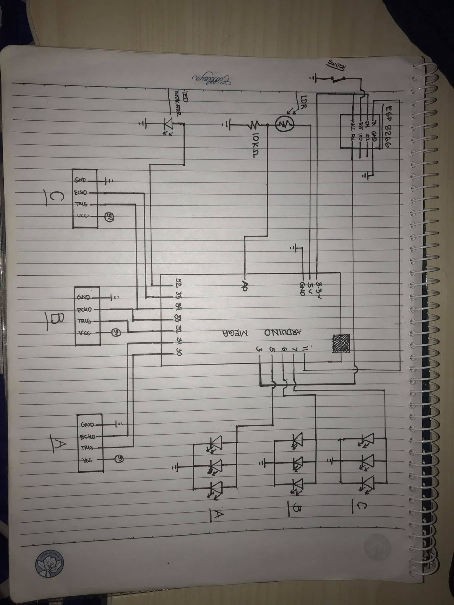

# IOT-Based-Intelligent-Streetlights
IOT Intelligent Street lights are composed of special features which enables the automation of the streetlights. These IoT Intelligent lights can ensure low power consumption than the traditional streetlights. Lastly, these street lights consist of database and user interface which can lessen manpower and enables remote monitoring.
*Powered by Arduino, ESP8266, HTML5, Bootstrap, PHP, MYSQL*

## Pin Configurations

* **LDR** = Analog 0

* **ESP-8266**
	* tx = digital 11
	* rx = digital 3

* **Ultrasonic A**
	* trig = digital 14
	* echo = digital 15

* **Ultrasonic B**
	* trig = digital 16
	* echo = digital 17

* **Ultrasonic C**
	* trig = digital 18
	* echo = digital 19

* **LED A (3pcs Parallel Connection)** = digital 5

* **LED B (3pcs Parallel Connection)** = digital 6

* **LED C (3pcs Parallel Connection)** = digital 7

* **LED Indicator** = digital 52

## Wiring Diagram

## Web Page

https://pupiotdevelopment.000webhostapp.com/

